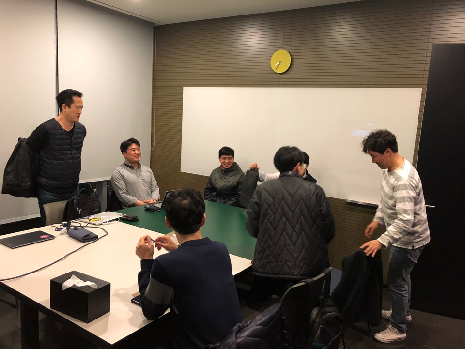
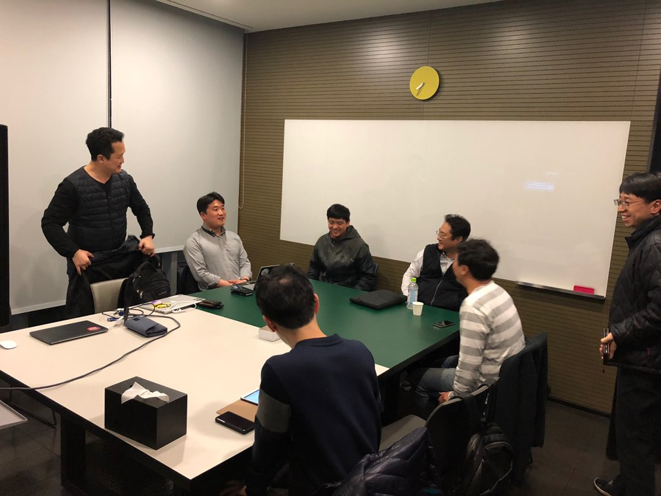
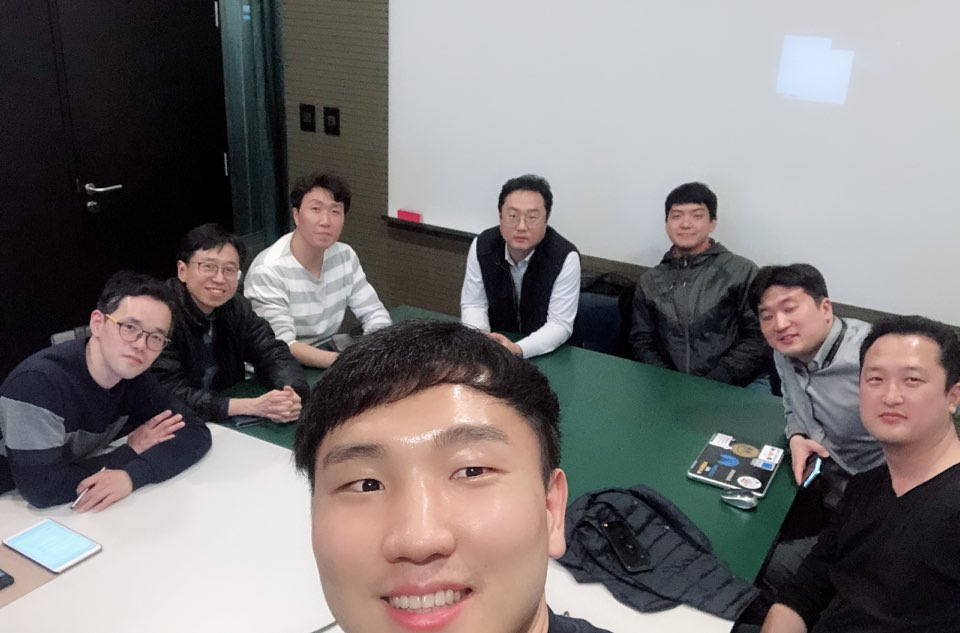

## 2019년 3월 19일

### 자격증 시험 정보
- 어소시에이트 솔루션즈 아키텍트 시험 응시료 150달러
- 클라우드 종사자 시험 응시료 100달러
- 클라우드 종사자 시험 합격하면 다른 시험 응시료 반값
- 클라우드 종사자 시험 보고 어소시에이트 시험 보면 총 175달러
- 클라우드 종사자 시험은 유투브에 강의가 있음

### 다음 주 부터 스터디 방향
- 각 서비스들에 대한 내용 파악
- AWS Certified Solutions Architect (공식 가이드북) 참고해서 스터디 진행
- 다음주 모임까지 VPC에 대한 내용 공부
- 모임 당일 날 공식 가이드북에 있는 VPC 관련 문제 풀고 토론

### To Do List
- AWSKRUG 깃헙에 레파지토리 생성
- 모임 당일 날 Exam 인원 수 맞게 프린트

### 모임 사진

